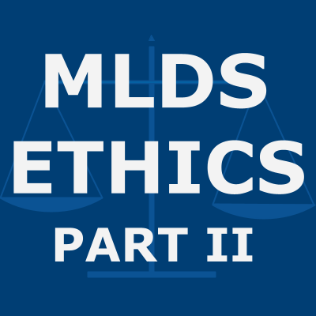

<h1 align="center"> ethics-two-resources </h1>

Course materials for Part 2 of the course "Ethics in Data Science and Artificial Intelligence"

  

  

## Welcome Back 

Hello and welcome back for the second part of the ethics in data science and AI module. 

Since the end of the first course, you have taken classes in supervised learning and exploratory data analysis. These courses will have equipped you with detailed knowledge about the inner workings of the most common approaches to supervised learning. You'll also have developed your skills in communicating your findings in a professional, accessible and engaging manner to specialists from other fields. 

While you might not have realised it at the time, you've also picked up the skills and knowledge required to explore more deeply the ethical principles that we introduced at a surface level in Ethics Part I. In this second part of the ethics module, we'll be iterating on what you have learned already. You'll refine and extend your knowledge of the ethical issues that confront a data practitioner and of the tools available to address, or at least to mitigate against, those issues.

## Course Outline

Within Ethics Part II we will mainly be focusing in on the principles that we previously introduced as interpretability and explainability. We'll delve into these topics in greater detail than you are likely to have done before, raising awareness of new issues and novel methods to address them. Before we get onto these exciting new topics, we will first revisit some topics that will form the foundations for this course.

In Week 1 we will revise and explore the interpretation of linear and logistic regression models. This is material that you have covered before, but we will be taking a different perspective here. We will be highlighting interesting edge cases and focusing on the end-user's experience of your model interpretation. Considering these simple and supposedly easy to interpret models with only a few predictors will give us valuable insights into might go awry in more complicated settings. We will then take what we have learned about interpreting these simple, explainable models and consider how this can be generalised to other machine learning models.

## Course Logistics

### Material Release 

New course videos, activites and readings will be added each week on Fridays at Midday (UK). 

### Contact Hours

Contact hours will be held every week on Fridays, at 09:00 and 16:00 (UK). If you have questions between these sessions please feel free to post them on the [EdStem forum]() for responses from course staff and your fellow students.

**Live sessions** for Ethics Part II will review and/or extend the material each week and will alternate between the 09:00 and 16:00 timeslot each week. Live sessions will be recorded for the benefit of those who are unable to attend synchronously because of other commitments or time zone issues. If you cannot attend live please contribute to discussion of the material on the Ed discussions forum instead.

**Office hours** will be held every week on Fridays, in the alternate time slot to live sessions. Office hours provide the opportunity for informal group discussion of the course material and how it fits into to the wider context of this programme and your work as a data scientist. 

You should take the lead in these sessions - turn up prepared with issues or discussion topics to raise with the rest of the group. If you have no questions of your own, please still feel free attend and join in the discussion. The more points of view and experiences we have to share, the more interesting these sessions will be. Note that office hours are not recorded. 

### Ed Discussion Board

Access the Ed discussion board here. 

### Assessments

Part II of the course contributes 40% of your total grade for the module. There will be three assessed elements:

- weekly peer-reviewed written summaries of your assigned reading,

- one group assessment that will run throughout the course,

- one individual assessment that will be released near the end of the course.

|     Assessment Type    |    Release Date   |      Due Date                      |   % of Ethics Module  |
|:----------------------:|:-----------------:|:----------------------------------:|:---------------------:|
|  Reading Summaries     |  Weekly Fri 12:00 |  Following Wed/Fri 09:00           |   5                   |
|  Group Assessment      |  2024-05-27 09:00 |  2024-06-12 09:00 (Progress Update)|   -                   |
|                        |                   |  2024-06-28 09:00 (Submission)     |	  20                  |
|  Individual assessment |  2024-06-24 09:00 |  2024-07-08 09:00                  |   15                  | 

### Reading Summary Details

As in Part I of the course, you will have the opportunity to submit up to 6 reading summaries. These will be peer-marked and these marks will be moderated by the course lecturer and/or graduate teaching assistants. Your reading summary grade will be calculated as the average of your 5 highest scoring submissions. In particular, this means that you can miss one submission without any consequence.

**Note:** each reading summary requires you to write your own summary **and** to provide feedback to other students.

The weekly deadline for your written submission is **Wednesday at 09:00 (UK)** and the weekly deadline for the peer-feedback is **Friday at 09:00 (UK)**. 

## Happy Learning!

Thank you for reading this introductory message, I hope that you enjoy the course and look forward to a term of lively discussion!
